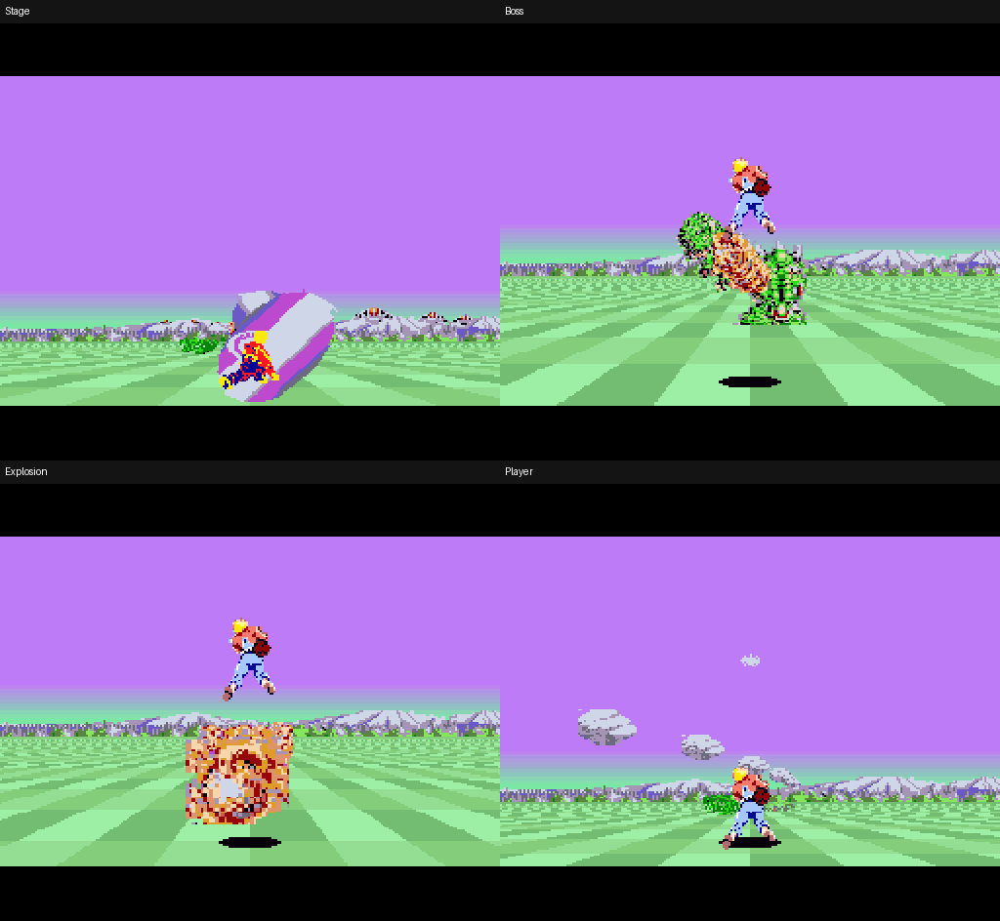

# 4bpp・30fps版：録画切り抜き素材への切り替え（2026年10月9日）

ユーザーが承認した物体だけの黒背景・16色実験を、実際の4bppカラーROMへ反映した。採取後の二色塗り直しと固定ディザを外し、録画の色画素と陰影を減色の入力にする。木、草、岩、飛行敵、小型敵の開閉、ボス、爆発、炎形のボス弾が対象。自機は専用OBJ色とmainの服の透明穴修正を継承する。

## 起動と分岐

- [カラーROM](../../releases/MonoSHFX2_4bpp30_color.sfc)／[白黒素材の比較ROM](../../releases/MonoSHFX2_4bpp30_mono.sfc)
- [起動cmd](../../play_4bpp30.cmd)／[エディタ起動cmd](../../edit_4bpp30.cmd)
- [ビルド・操作・同期手順](../../README_4BPP30.md)

作業場所は `D:\HomeBrew\MonoSHFX2_4bpp30_20261008`、ブランチは `experiment/4bpp-30fps-20261008`。main `41f84bfa8355c65f6dbe30a2a498acdd75398217` までを一方向にmergeした。mainの作業フォルダーは編集していない。Mesenで直接起動できる。矢印で移動、X連射、Z単発、Enterポーズ。NTSC、GSU 100%。起動中の約1.5秒の非表示で音源を読み込む。

## 素材の生成と確認

共通パレットは15色＋透明のindex 0。不透明物体から12色を学習し、通常弾の紫・青・赤は録画由来の代表色を各1色確保する。空・地面・山・自機を色選びの学習対象へ混ぜない。山と森のGSU画像も同じパレットで表示するが、学習には使わない。空と地面は別のRGB5 HDMA、自機は専用15色。画面全体が16色という制約ではない。

木は承認済みの葉・幹・暗い輪郭の分離を使う。小型敵は位置を追跡して開閉姿勢を取り直した。隣の胴が重なるボス胴の端だけ、同じ姿勢の旧原画を採取境界に使用する。拡縮は最近傍で縦横を一緒に変え、投影比率の違いは透明余白で調整する。元の二値マスクによる塗り直しはしない。

通常弾は旧四姿勢の主軸と輪郭を半分の原画寸法で保持し、録画の短軸方向の階調を移す。別の撮影姿勢の傾きは移さない。白い中心と単色の両側の陰影、32更新周期（紫16→赤8→青8）、64更新の回転を維持。色周期別の原画と縮小行を事前生成し、パレット番号の加算を廃止した。炎形のボス弾は録画どおり橙色で描く。通常弾の周期は録画から推定したもので原作ROMからの抽出ではない。

[切り抜きと減色の比較](results/cutouts_20261009/materials.png)、[素材一覧](assets/color4/captures.png)、[実PPUの弾アニメ](results/color_review_20261009/bullet_cycle.gif)、[時刻・矩形・動画SHA256](assets/color4/source.json)。22採取素材の不透明27,666画素について元RGBの不変を検査し、全44素材の透明・最近傍による減色・ROM配置が一致した。ディザは使わない。旧35素材の二値一致は今回の採用で置き換わり、過去の証跡は旧ROMの記録として保持する。自機17姿勢、影、STAGE文字など全素材を新規に動画採取したわけではない。

## 転送・容量・速度

内部256×192、4bppの24KiBをVRAMの二面へ交互に転送する。既存の非表示203行以降〜次22行を二回使い、64pxの四本の帯を二本ずつ描画・転送し、完成世代だけを表示する。ゲーム計算と入力は画像ごとに2回。NTSCの目標は約30.0494fps。自機OBJは姿勢変更時に896bytesを加え、OAMと同じ世代で提示する。地面HDMAを維持する。

ROMは2MiB、原画89,354bytes、事前縮小行427,610bytes。音源用の `$59:1300..FFFF`（60,672bytes）を配置対象から除外する。透明の詰め物43はSTAGE左端の透明画素を参照し、音源を画像として読まない。音源の待機状態を挟む読み込みがプレイ中に約5ms/fieldを使うことを計測し、4bpp版だけ起動時に全て完了するようにした。

全量転送fixtureの各半分12KiBは最大4.851827ms。二つの非表示区間へ24KiBを送る帯域は成立するが、人工的な全面拡大では描画を含め15.0247fps。通常進行18,000fieldは30.0494fps、2fieldを超えた更新0回。GSUの半分の描画時間は最大15.373833ms。今回の通常進行では遅延0回。人工的な全画面拡大など任意の物量まで保証するものではない。

## 最終ROMの検証

|素材|場面|field数|平均描画fps|遅延回数|画素照合数|
|---|---|---:|---:|---:|---:|
|カラー|移動と連射|2,400|30.0494|0|19|
|カラー|ボス撃破・次周|2,600|30.0374|1|20|
|カラー|ボス継続|3,600|30.0494|0|29|
|カラー|死亡と復帰|720|30.0494|0|5|
|カラー|ポーズ|720|30.0494|0|5|
|カラー|全素材・四反転・clip|2,000|30.0494|0|957|
|カラー|全量転送|240|15.0247|37|38|
|カラー|通常進行|18,000|30.0494|0|149|
|カラー|自機17姿勢|920|30.0494|0|417|
|カラー|弾の色周期・回転|480|29.4361|7|193|
|白黒|移動と連射|2,400|30.0494|0|19|
|白黒|ボス撃破・次周|2,600|30.0374|1|20|

合計1,871標本で全49,152画素と表示中VRAMの24KiBを独立合成へ照合した。自機は実OAM・CHR・CGRAMから408条件を合成し、専用色・透明を元画像と照合。通常弾三発とボス炎弾で64位相を検査。地面CHR・mapの不変、DMAの非表示期間、通常の移動・連射、ポーズ、死亡と復帰、ボス撃破と次周も検査した。実機では未検証。

既定2bppビルドはmainの配布ROMと全2MiBが一致し、SHA256 `8c25249fc07cb935184ed47beac3cf1dd64f23ba5b691f30ec3aced01f5e82ae`。今回の共通ソース変更が2bppの機械語を変えないことを確認した。

- カラーROM SHA256: `e8ddb798acad34efd10da32771d898178c9efa3200a3fbca3a383bcc244a93aa`
- 白黒ROM SHA256: `eae47b467fa85f888cab1b6213cc961def3b779cd72456ae4b7b83283bef6703`

[colorの計測・識別](../../releases/4bpp30_color.json)／[mono](../../releases/4bpp30_mono.json)。実行Lua、trace、packet・FB・VRAM・OAM標本と画面を [結果フォルダー](results/four_bpp_20261008/) に保存する。以前のROMの速度を新ROMの保証には使わない。
