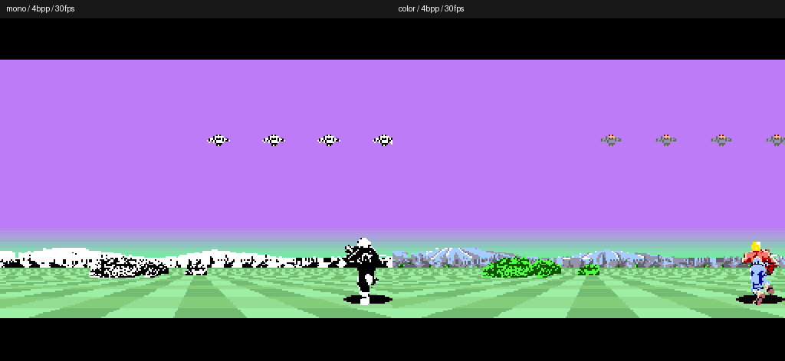

# 4bpp・30fps版の実装・検証結果（2026年10月8日）

## 結果と達成範囲

独立したカラー4bpp版と、元の白黒素材を4bpp化した比較版を作成した。通常進行18,000フィールドでは平均29.8421fps、画像更新間隔8,925回中124回が2フィールドを超えた。**全場面で30fps固定には未到達**。CPU準備・描画・転送の合計が締切を超える場面が残り、更新が遅れた時はゲーム進行も遅れる。

ゲーム計算と入力は各画像につき2回、画像は原則2フィールドごとに提示する。NTSCの目標は約30.0494fpsで、ゲームを30Hzへ半速化していない。通常進行は無敵化せず、通常の連射とボスに照準を合わせる方向入力を与え、ボス撃破・次周、29回の死亡と復帰を通過した。ボス個別試験はステージ終了条件と通常自弾の位置を設定するfixtureを使い、HPを書き換えていない。

## 独立性と起動

作業場所は `D:\HomeBrew\MonoSHFX2_4bpp30_20261008`、ブランチは `experiment/4bpp-30fps-20261008`。出発点は348d4d4。mainの4c5ec38までを一方向にmergeし、地平線・山裾・空・奥行き拡縮などの修正を継承した。元の作業フォルダー、NES版、FamiBASICのプロジェクトは編集していない。

- [カラーROM](../../releases/MonoSHFX2_4bpp30_color.sfc)／[白黒比較ROM](../../releases/MonoSHFX2_4bpp30_mono.sfc)
- [起動用cmd](../../play_4bpp30.cmd)／[エディタ起動](../../edit_4bpp30.cmd)
- [ビルド・操作・mainの取り込み手順](../../README_4BPP30.md)

MesenでROMを直接開ける。専用ランチャーはGSU 100%、NTSC。矢印で移動、X連射、Z単発、Enterポーズ。上下は従来どおり反転操作。VS CodeのF5はこの分岐の4bpp版をビルドして起動する。実機検証は未実施。

## 転送帯域と残るボトルネック

内部256×192の4bppは24,576bytes。表示は既存と同じ256×180。VRAMに24KiBの画像を二面置き、64pxの四本の縦帯を交互に二本ずつ描画・転送する。カラー版の自機は専用15色のOBJで表示し、VRAMの未使用領域C800..CB7Fへ姿勢変更時に896bytesを転送する。二つの半分と自機が揃ってからOAMと表示面を同じ世代へ切り替える。地面・空のHDMAは維持する。

DMAを使うのは強制非表示の走査線203以降と、次フィールドの22まで。現在の列範囲と転送先に残る旧範囲の和集合を送り、隣接区間は結合する。区間が多すぎる場合は担当する二本の帯全体へ切り替える。両半分のDMA完了時刻と表示面の24KiBを検査した。

全量fixtureでは12KiBずつ、各2記述子、最大4.851827msで画像DMAが完了し、次フィールドの19行までに収まった。したがって**24KiBを二つの非表示区間へ分ける帯域自体は成立する**。追加の自機CHR転送が入る時は安全な非表示区間を待ち、表示面を先に切り替えない。ただし全面に拡大した物体を描くこの人工試験は描画とDMAの合計時間が長く、提示は平均15.0247fpsになる。全転送が収まることは、描画まで含めた常時30fpsの保証ではない。

通常進行のDMA最大は15,520bytes/画像。GSUの半分の描画時間は最大15.492657msで、1フィールドの時間（約16.64ms）以内に収まった。締切には描画だけでなくCPU準備とDMAも含まれ、合流が間に合わなければ次の黒帯へ待つ。VRAM容量不足で画面が欠ける現象と、描画・準備・転送の合計時間を分けて扱う。

ボス胴・顔・爆発4姿勢・ボス弾の水平縮小行を事前計算し、699,132bytesを原画bankの空きへ配置した。ROMは元の2MiBに維持。整数刻みの水平参照と、SNES乗算器による爆発の高さ計算も追加した。事前計算にない幅・高さは汎用経路へ戻し、反転・clipも元のQ8.8と一致させた。

胴・顔の縮小行だけは1画素1byteで置き、描画中の4bit展開を省いた。他の5原画は2画素1byteを維持する。ROMの容量と描画時間をこの二種類で配分する。
通常向きの胴・顔は経路を先に選び、使用しない水平UV計算も省く。寸法が対象外なら元のUV計算と汎用描画へ戻す。

さらに拡縮準備のUV処理で描画kernelの命令cacheを入れ直さず、連続するボス部品で保持する。転送区間plannerの16列loopと背景二層の境界計算・画素loopもcacheへ置いた。元の2bpp経路のCACHE命令は変更しない。

## 素材と色の範囲

自機を採取した同じ `スペースハリアー録画１.mp4` をコマ送りで確認し、部位ごとの色を修正した。草二種類は緑、ボスの顔は93.4%が緑、胴は緑の背中と茶色の腹。別姿勢の切り抜きの色を座標だけで重ねる方法と、明るさだけを優先した配色を改めた。[録画の確認フレーム](results/color_review_20261008/reference_frames.png)、[修正素材](results/color_review_20261008/materials.png)、[採取一覧](assets/color4/captures.png)、[時刻・矩形・動画SHA256と形の基準](assets/color4/source.json)を保存した。

35素材はPNGとROM内画素の両方で透過輪郭が元原画に完全一致する。うち30素材は通常のグレースケールを128で二値化しても元原画と一致する。弾5素材は白い中心と同系色の両側の陰影へ直したため、内部の白黒模様の一致対象から除く。[原画・カラー・白黒復元の比較](results/legacy_shapes_20261008/comparison.png)と [検証値](results/legacy_shapes_20261008/summary.json)を保存し、継続同期でも再検査する。

通常弾は一発につき一つの色相を使い、経過時間の32論理更新周期（紫16→赤8→青8）で色を変える。白い中心は色相変更の対象外。回転は元の64更新周期を維持する。ボス光弾は全体の論理時間に従い同じ色周期を使い、三色の縮小行を用意した。周期は録画のサンプルから推定した値であり、原作のパレットデータを抽出したものではない。[実ROMの色アニメ](results/color_review_20261008/bullet_cycle.gif)を保存した。

**4bppは16色インデックスであり、16bppの無損失カラーではない。** GSUの合成画像は共通15色＋透明色、自機は元の専用15色＋透明色をそのまま使う。自機8姿勢と派生の転倒9姿勢を共通パレットへ減色しない。空と地面は別のRGB5 HDMAを使う。弾の陰影は白と同系色二段階を固定ディザで補間する。原画RGBAは保持する。影・STAGE文字は従来素材であり、すべての姿勢を動画から直接採取したわけではない。

## 計測と正しさ

Mesen、GSU 100%、HDMA有効。起動時の長い最初の間隔を除き、完成画像が次に見えるフィールドの差からfpsを計算した。フィールド境界をまたぐ面切替を単純な1/3間隔と誤算しない。以下の遅延回数は2フィールドを超えた更新間隔。

|素材|試験|フィールド数|平均描画fps|遅延回数|画素照合数|
|---|---|---:|---:|---:|---:|
|カラー|移動＋連射|2,400|30.0494|0|19|
|カラー|ボス撃破・次周|2,600|30.0494|0|21|
|カラー|ボス維持・無射撃|3,600|30.0494|0|29|
|カラー|被弾・復帰|720|30.0494|0|5|
|カラー|ポーズ・解除|720|30.0494|0|5|
|カラー|全素材・反転・clip|1,784|30.0494|0|881|
|カラー|全24KiB転送fixture|120|15.0247|23|24|
|カラー|通常進行・照準操作|18,000|29.8421|124|148|
|カラー|自機17姿勢・反転・clip・点滅|920|30.0494|0|449|
|カラー|弾64位相・同時三発＋ボス光弾|240|29.7686|2|107|
|白黒|移動＋連射|2,400|30.0494|0|19|
|白黒|ボス撃破・次周|2,600|30.0377|1|21|

合計1,728枚について、独立したPython合成器が全49,152画素と表示中VRAMの24KiBに一致した。全44素材×四反転×五寸法・clip条件は880通り＋次周期1枚。自機は実OAM・CHR・CGRAMから別途RGBA合成し、17姿勢×四反転×六条件の408通りが元の専用カラー画像と一致した。弾は異なる年齢の通常弾三発とボス光弾を同時に描き、64位相と色周期を全て照合した。地面CHRとマップが上書きされないことも検査する。ポーズ中60論理更新分の停止・再開、被弾から復帰、移動入力と連射もassertした。検証入力はMesenの`inputPolled`イベントへ渡す。

途中で検証入力を`startFrame`から渡していた誤りを修正し、通常操作・連射・ポーズ・死亡・長時間進行を測り直した。旧測定値を最終結果に混ぜていない。検証callbackの失敗は`pcall`で捕捉して異常終了させ、エラー後にゲームだけ走り続ける誤判定も防ぐ。

分岐実装後の2bpp回帰試験では、既定ビルドとmain由来の配布ROMの全2MiBが完全一致した。SHA256は `4ef5a95fec70a4ee3dfcf3b9f39ea38180aa138fd44b7709fed8b21704197025`。そのROMで720フィールドの操作・FB・OBJ照合も成功。共通build変更で元版の機械語が変わっていないことを確認した。継続同期スクリプトも取り込み後に既定ビルドとmain配布ROMの完全一致を検査する。

### ROMの識別

- カラー: `f403f87c92be39e52bddd51127f89fc2b46db9c005771ff47db0dc585766cf06`
- 白黒: `007d1cb84fb04c80f4764a992f170645ff843eece4d277d5634a609ab13dc499`

ROM別の要約は [color](../../releases/4bpp30_color.json)／[mono](../../releases/4bpp30_mono.json)。各試験のtrace・実行Lua・画面・packet・FB・VRAM標本を [結果フォルダー](results/four_bpp_20261008/) に圧縮して保存した。以後の計測でもROMのSHA256を分け、以前の結果を新ROMの保証として流用しない。
